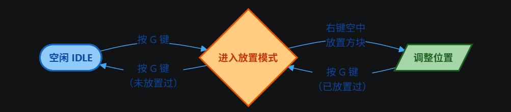

<h1 align="center">KXsNHToolBox</h1>

  
  
  

## 项目概述
KXsNHToolbox 是一个为 GT NewHorizon 开发的工具型模组

通过添加一系列作者认为有用的 ~~（大概吧）~~ 功能改善游戏体验

> [!WARNING]
> 本模组非GTNH官方模组，请勿在官方场合讨论相关内容

## 核心功能

### 新增物品

<b> 扩展显示元件 </b>

<ul>
  <li> 由显示元件合成而来 </li>
  <li> 右键存储总线（物品/流体）直接复制存储总线标记内容 </li>
  <li> 其他内容与原版显示元件一致 </li>
</ul>

### 新增功能

<b> 浮空放置 </b>

  

<ul>
  <li> 默认按下 `G` 键激活/关闭浮空放置模式 </li>
  <li> 右键点击可在视角方向的绿色框中放置手中的可放置物品 </li>
  <li> 使用方向键调整已放置方块的位置 </li>
</ul>

### 适配版本
|  GTNH 版本  | 起始兼容版本 | 最新兼容版本 |                                                           下载                                                            | 维护状态 |
|:---------:|:------------:|:------------:|:-------------------------------------------------------------------------------------------------------------------------:| :--: |
|   2.9+    |    0.2.0     |    0.2.0     |  |  ✔️  |
---
